# Active Directory Azure Lab

Azure-based Active Directory lab using Windows Server 2022. Covers Domain Controller setup, Organizational Units, user creation, Group Policy configuration, password resets, account disabling and deletion.

---

## Table of Contents

1. [Azure VM Setup](#azure-vm-setup)
2. [Installing Active Directory](#installing-active-directory)
3. [Organizational Units and Users](#organizational-units-and-users)
4. [Help Desk Tasks](#help-desk-tasks)
5. [Group Policy](#group-policy)

---

## Software Used

- Microsoft Azure
- Windows Server 2022
- Active Directory Domain Services (AD DS)
- Group Policy Management
- PowerShell

---

## Environments Used

- Windows Server 2022
- Azure Virtual Machine

---

## Azure VM Setup

In this lab, a Windows Server 2022 virtual machine was provisioned on Microsoft Azure to act as the Domain Controller. The VM was configured with a static private IP address to ensure stable network communication, and remote access was established via RDP.

The virtual machine runs Windows Server 2022 on a Standard E2s v3 instance with 2 vCPUs and 16GB of RAM.

- A Windows Server 2022 virtual machine was provisioned on Microsoft Azure to serve as the Domain Controller for this lab.

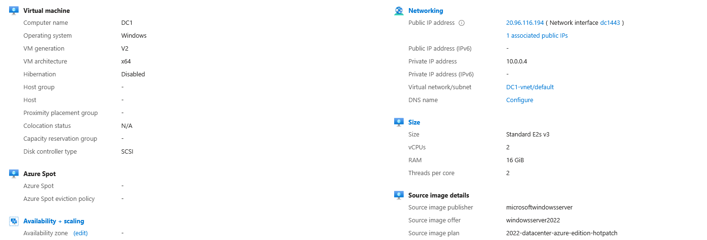

- A static private IP address was assigned to the network interface of the VM. This is a critical step when setting up a Domain Controller. If the IP address changes, domain-joined machines will lose the ability to locate and authenticate with the controller, breaking the entire domain.

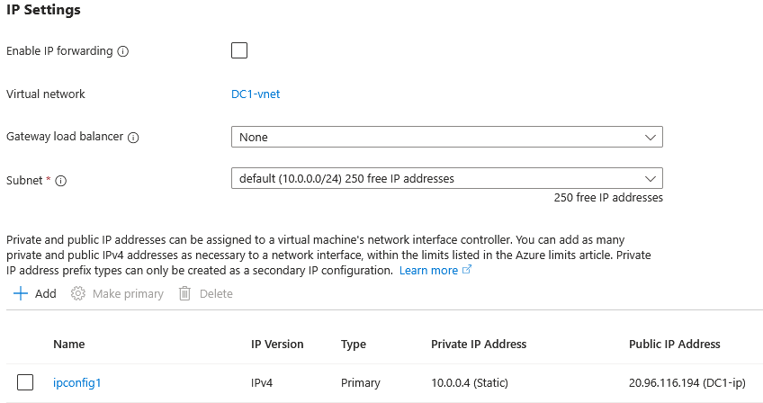

- The virtual machine was accessed via Remote Desktop Protocol (RDP). Server Manager launched automatically on login, confirming the server is live and ready for configuration.

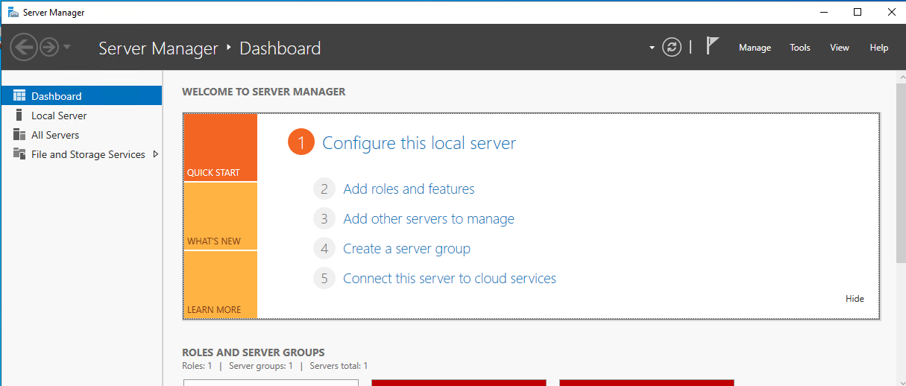

---

## Installing Active Directory

### Installing the AD DS Role

To turn the server into a Domain Controller, the Active Directory Domain Services (AD DS) role must first be installed through Server Manager. This installs all the necessary components before the server can be promoted.

To do this, open Server Manager, click **Manage**, then **Add Roles and Features**. Select **Role-based or feature-based installation**, select the server (DC1), and on the Server Roles page check **Active Directory Domain Services**. When prompted, click **Add Features** and proceed through the wizard to install.

- The Active Directory Domain Services role was added through Server Manager to enable the server to function as a Domain Controller.

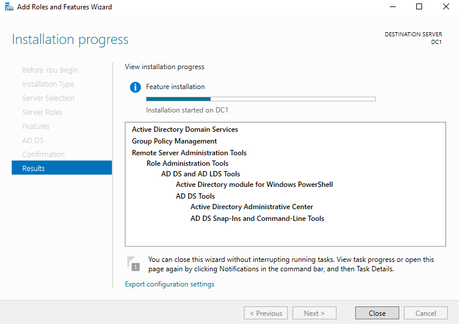

### Promoting the Server to a Domain Controller

Once the AD DS role is installed, a yellow notification flag appears in Server Manager. Clicking it and selecting **Promote this server to a domain controller** launches the promotion wizard.

**Add a new forest** was selected since this is a brand new domain with no existing infrastructure. The root domain name was set to **helpdesk.local**. A DSRM (Directory Services Restore Mode) password was also set, which provides emergency access to the domain controller if the AD service becomes inaccessible.

- The server was promoted to a Domain Controller and a new forest was created with the root domain name helpdesk.local.

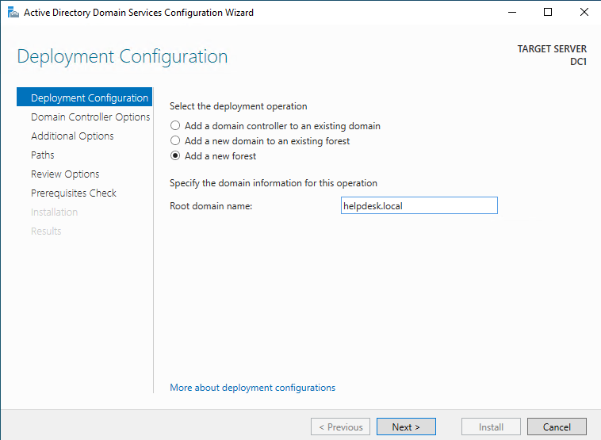

### Confirming the Domain is Live

After the server restarted, Active Directory Users and Computers (ADUC) was opened from the Tools menu in Server Manager. The domain **helpdesk.local** appearing in the left panel confirms that Active Directory is installed and the domain is live and ready for configuration.

- Active Directory Users and Computers was opened from Server Manager confirming the domain helpdesk.local is installed and ready for configuration.

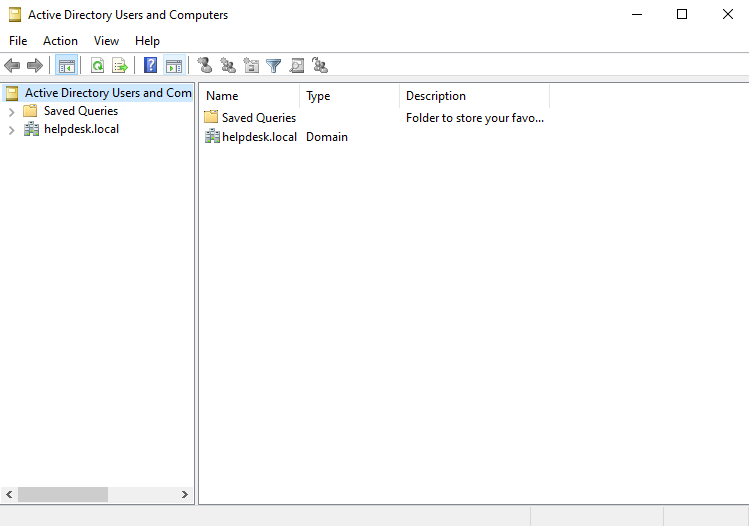

---

## Organizational Units and Users

### Organizational Units

Organizational Units (OUs) are containers within Active Directory used to organize users, computers, and groups into logical structures that mirror real company departments. OUs also allow Group Policy Objects to be applied at a departmental level rather than across the entire domain.

The following OUs were created within helpdesk.local:

- **IT** - Contains IT support staff and administrators
- **HR** - Contains human resources personnel
- **Finance** - Contains finance department users
- **Disabled Accounts** - Holds accounts that have been disabled pending deletion

- Organizational Units were created to mirror a real company structure, separating users by department and providing a dedicated location for disabled accounts.

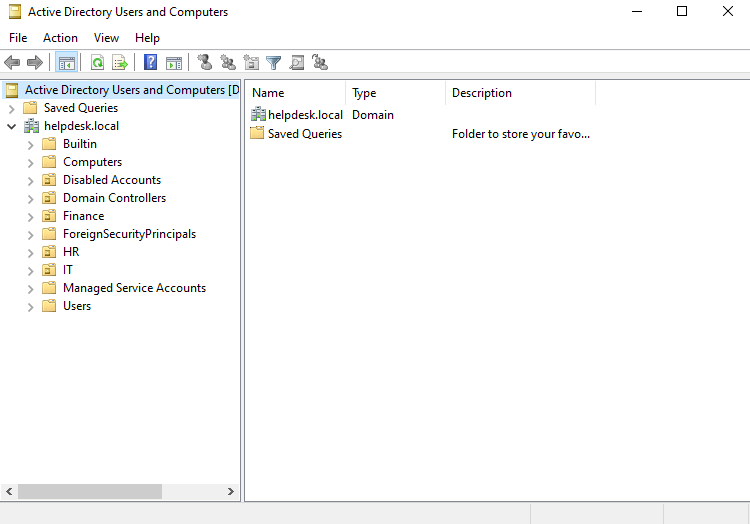

### Creating Users

Test users were created within each department OU to simulate a real company environment with employees across multiple departments. Users were created by right-clicking the target OU, selecting **New > User**, and filling in the first name, last name, and username.

- Test users were created across each Organizational Unit to simulate a real company environment with employees across multiple departments.

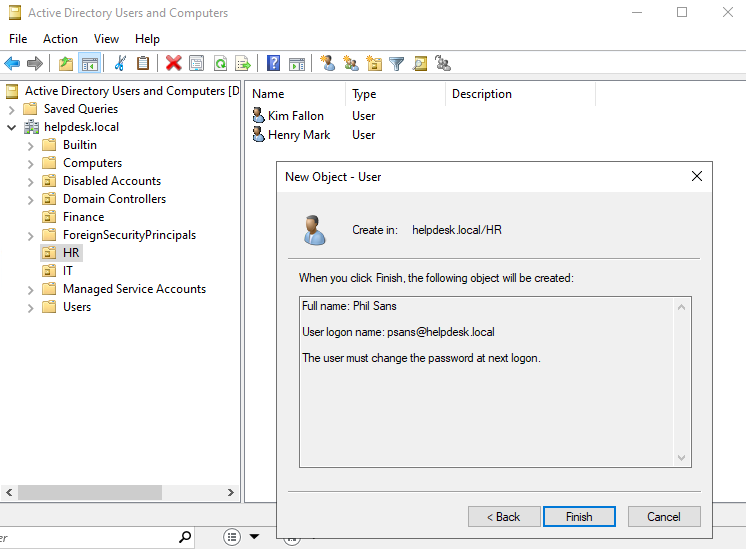

### Security Groups

Security groups were created within each department OU to allow for group-based access control and permissions management. The IT-Staff and HR-Staff groups were created by right-clicking the OU, selecting **New > Group**, and setting the group scope to **Global** and the group type to **Security**.

- Security groups were created within each department OU to allow for group-based access control and permissions management.

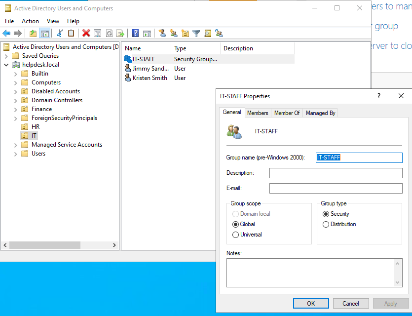

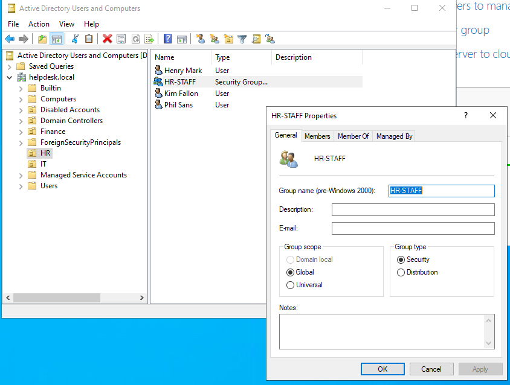

### Adding Users to Groups

Users were added to their security groups by right-clicking the group, selecting **Properties**, navigating to the **Members** tab, and clicking **Add** to search for and add users.

- Users were added to their respective security groups to simulate real group membership management performed by help desk and IT administrators.

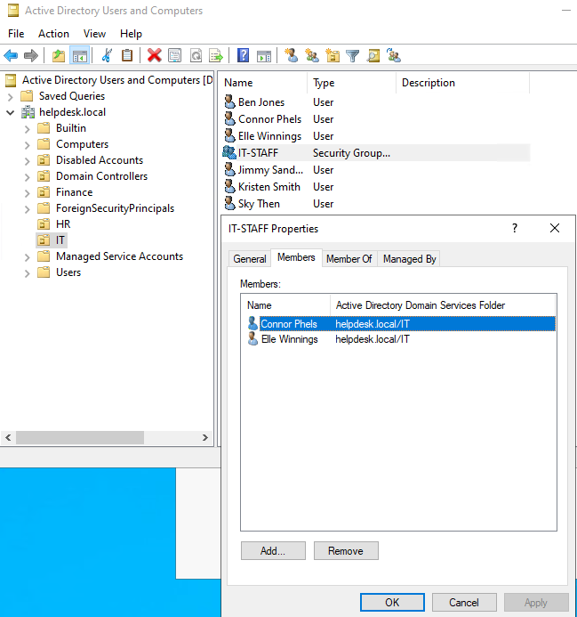

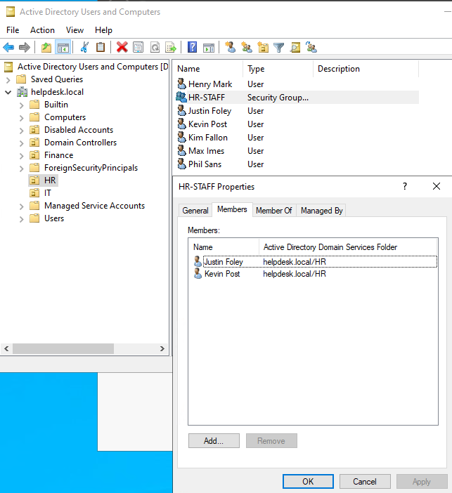

---

## Help Desk Tasks

This section covers the most common tasks performed by help desk technicians on a daily basis. Each task below was performed within Active Directory Users and Computers (ADUC).

### Task 1: Password Reset

Password resets are one of the most frequent help desk requests in any organization. To reset a password, right-click the user in ADUC and select **Reset Password**. A new temporary password is entered and the **User must change password at next logon** checkbox is checked, which forces the user to set their own password on their next login.

- A password reset was performed on a user account, simulating one of the most common help desk tasks. The user was required to change their password on next login.

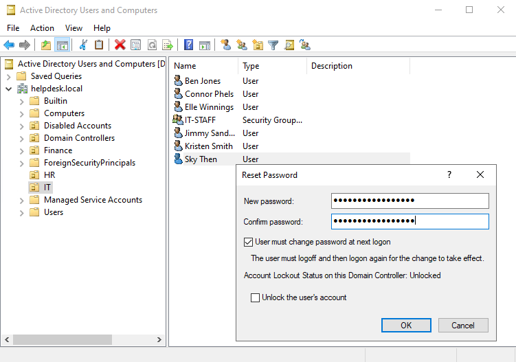

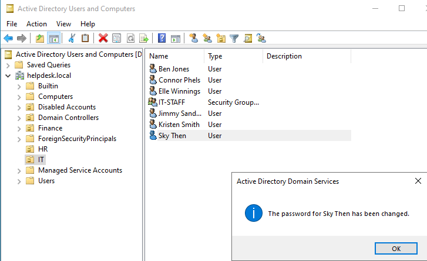

### Task 2: Disable a User Account

When an employee leaves a company, their account should be disabled before deletion. This preserves audit logs and access history tied to the account. To disable an account, right-click the user and select **Disable Account**. A down arrow icon appears on the user's icon confirming the account is disabled.

- A user account was disabled to simulate an employee offboarding workflow. Disabling before deleting preserves audit logs and is standard IT practice.

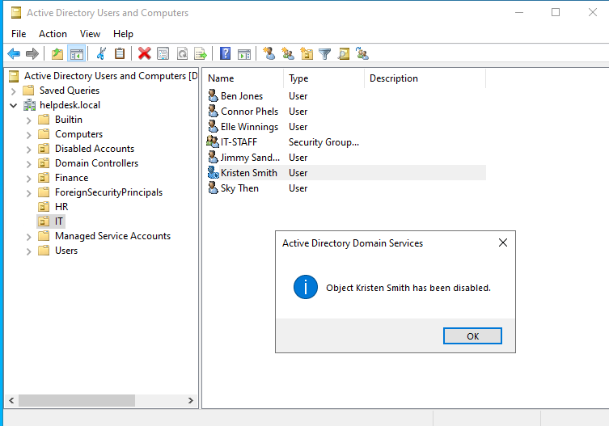

### Task 3: Unlock a Locked Out Account

Accounts can become locked out after too many failed login attempts, which is a very common help desk ticket. To unlock an account, right-click the user, select **Properties**, navigate to the **Account** tab, and check the **Unlock account** checkbox.

- A locked out user account was unlocked through the Account tab in Active Directory Users and Computers, simulating a common help desk request.

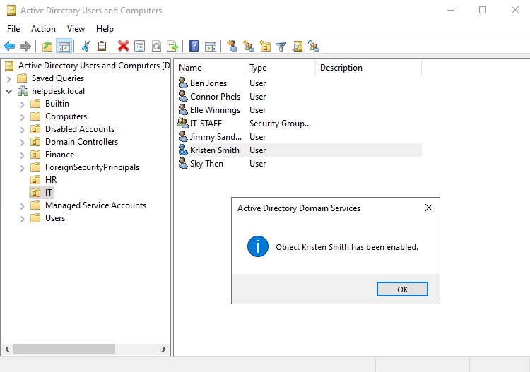

### Task 4: Move a Disabled User to the Disabled Accounts OU

As a best practice, disabled accounts should be moved to a dedicated Disabled Accounts OU to keep the directory organized and clearly separate active from inactive accounts. To move a user, right-click the account and select **Move**, then choose the Disabled Accounts OU.

- The disabled user was moved to the Disabled Accounts Organizational Unit to keep the directory organized and clearly separate active from inactive accounts.

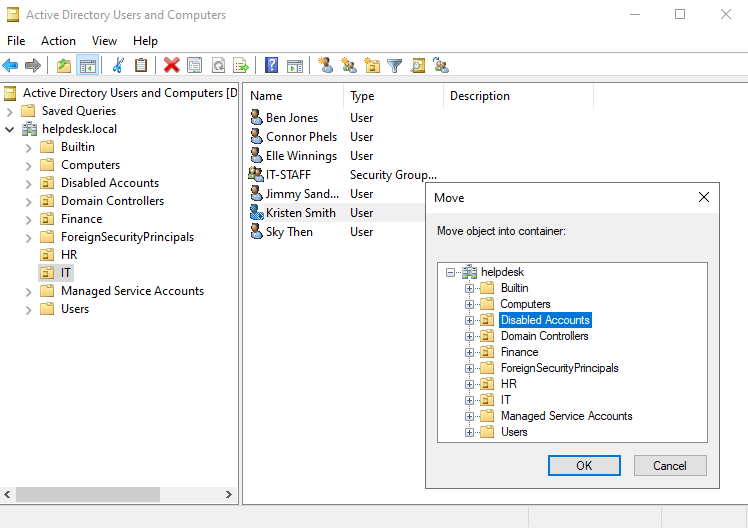

### Task 5: Delete a User

Once a disabled account has been confirmed as no longer needed, it can be permanently deleted. Right-click the user and select **Delete**. Deleting from the Disabled Accounts OU ensures proper offboarding procedure was followed before removal.

- A user account was permanently deleted after being moved to the Disabled Accounts OU, following proper offboarding procedure before removal.

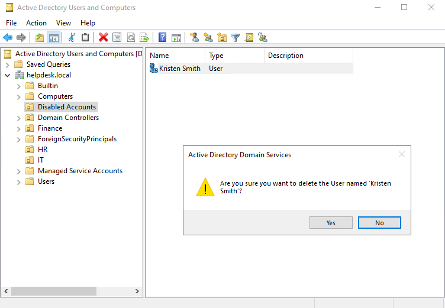

---

## Group Policy

Group Policy Objects (GPOs) are a feature of Windows Server that allow administrators to centrally manage and enforce settings for users and computers across an Active Directory domain. GPOs can be linked to the domain itself or to specific OUs, giving administrators granular control over who the policies apply to.

### Opening Group Policy Management

Group Policy Management was opened from the Tools menu in Server Manager. The console displays the domain structure on the left panel, showing where GPOs are linked and which OUs they apply to.

- Group Policy Management was opened from Server Manager to begin creating and linking Group Policy Objects to Organizational Units within the domain.

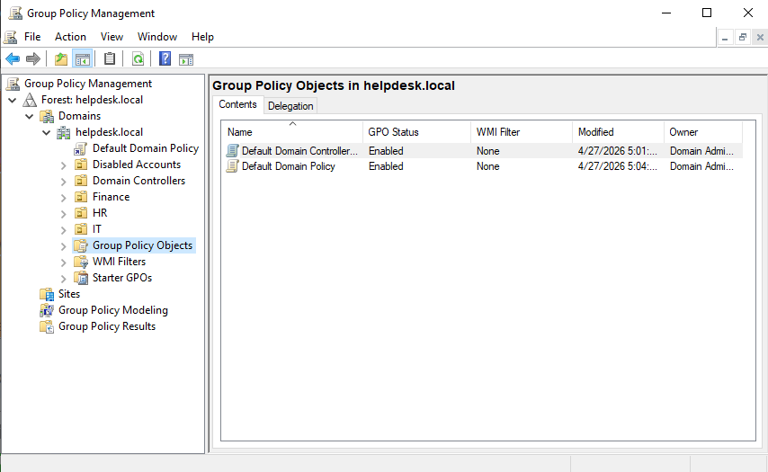

### Account Lockout Policy

An Account Lockout Policy was configured to lock user accounts after 5 failed login attempts. This is a standard security measure in enterprise environments that protects against brute force attacks.

To configure this, a new GPO named **Account Lockout Policy** was created under Group Policy Objects, then edited by navigating to:

**Computer Configuration > Policies > Windows Settings > Security Settings > Account Policies > Account Lockout Policy**

The **Account lockout threshold** was set to 5 invalid logon attempts.

- An Account Lockout Policy was configured to lock user accounts after 5 failed login attempts, a standard security measure in enterprise environments.

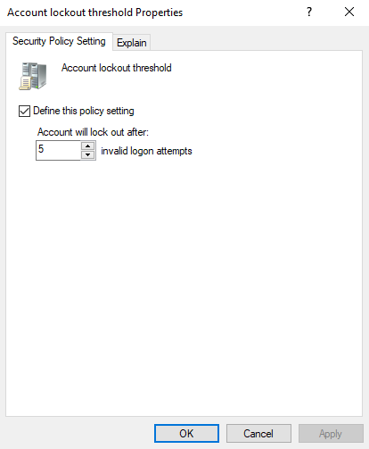

### Disable Control Panel

A GPO was created to disable Control Panel access for standard users, preventing unauthorized changes to system settings. This is a common policy applied to non-IT department users in corporate environments.

To configure this, a new GPO named **Disable Control Panel** was created and edited by navigating to:

**User Configuration > Policies > Administrative Templates > Control Panel**

The **Prohibit access to Control Panel and PC settings** policy was set to **Enabled**.

- A Group Policy Object was created to disable Control Panel access for standard users, preventing unauthorized system changes across the domain.

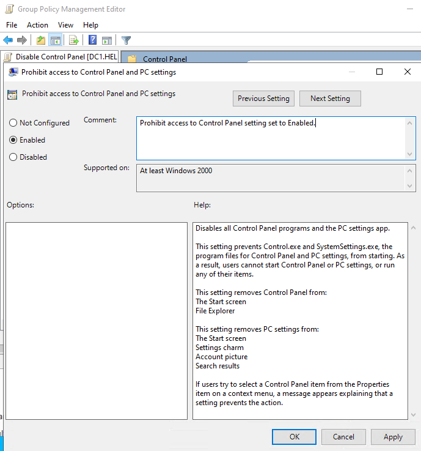

### Linking GPOs and Applying Changes

The GPOs were linked to their targets within Group Policy Management. The Account Lockout Policy was linked to the domain so it applies to all users, and the Disable Control Panel GPO was linked to the HR OU. To apply the changes immediately, gpupdate /force was run in Command Prompt on the server.

- The Group Policy Objects were linked to their Organizational Units and domain. Changes were applied immediately using gpupdate /force from the command line.

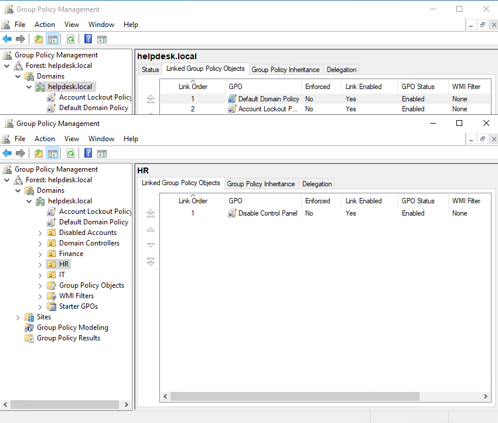

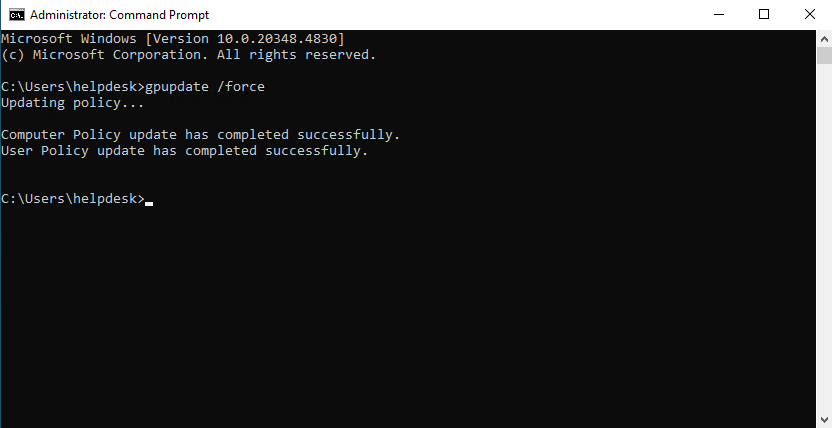

---

## Challenges and Takeaways

**Challenges:**

- Setting the static IP correctly before promoting to Domain Controller
- Getting the RDP connection working after the server restarts as a Domain Controller because the login format changes to HELPDESK\Administrator
- Understanding the difference between disabling and deleting a user and why you should always disable first

**Takeaways:**

- Understanding how Organizational Units mirror real company department structures
- Seeing how Group Policy lets you enforce security settings across an entire organization from one place
- Learning that a Domain Controller needs a static IP because every machine on the network depends on it to authenticate
- Getting comfortable with ADUC as the main tool help desk techs use daily for user account management
